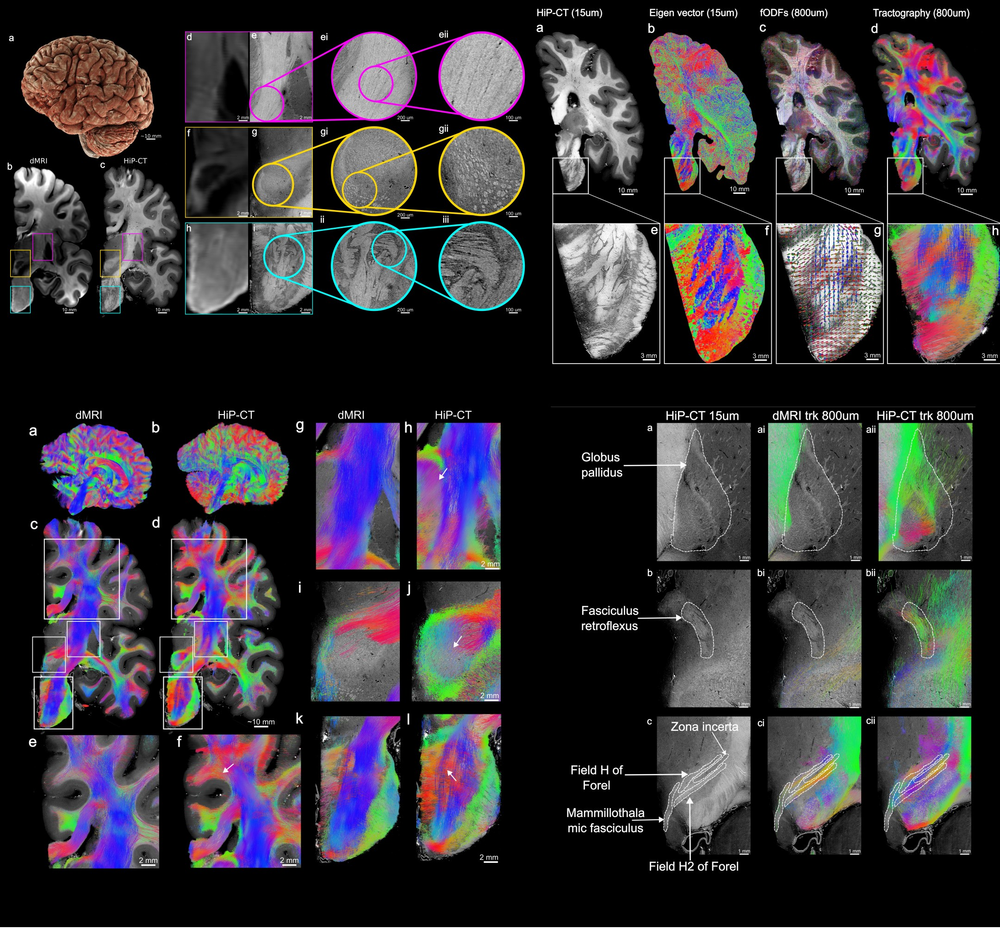

# Bridging the microstructural gap in human connectomics using HiP-CT as a reference for diffusion MRI



Code repository for the paper:

> **Bridging the microstructural gap in human connectomics using hierarchical phase-contrast tomography as a reference for diffusion MRI in the human brain**
>
> Eric Wanjau, Matthieu Chourrout, Chiara Maffei, Yael Balbastre, Andrew Keenlyside, Joseph Brunet, Aikta Sharma, Susie Y. Huang, Paul Tafforeau, Bruce Fischl, Anastasia Yendiki, Peter D. Lee, Claire L. Walsh
>
> *Nature Communications* (submitted) | [Preprint on bioRxiv](https://www.biorxiv.org/content/10.64898/2026.04.02.715729v1)

## Overview

We position Hierarchical Phase-Contrast Tomography (HiP-CT) as a transformative imaging modality for characterizing white matter in a manner that is complementary to diffusion MRI (dMRI). The pipeline applies Structure Tensor Analysis (STA) to HiP-CT data to compute fiber Orientation Distribution Functions (fODFs) and perform tractography analogous to dMRI. By integrating high-resolution
X-ray phase-contrast imaging with dMRI, this work paves the way for multi-modal, multi-scale studies of brain connectivity in health and disease.

## Pipeline

Scripts in `scripts/` are numbered by analysis stage:

| Step | Script | Description |
|------|--------|-------------|
| 1 | `01_mask_preparation.py` | Upsample organ masks to full resolution, apply to HiP-CT volumes |
| 2 | `02_structure_tensor.py` | 3D structure tensor analysis (Gaussian derivatives, eigendecomposition) |
| 3 | `03_fodf_estimation.py` | Aggregate eigenvectors into supervoxel fODFs via spherical harmonics (800 µm) |
| 3 | `03_fodf_estimation_400um.py` | Same pipeline at 400 µm resolution |
| 4 | `04_registration.py` | Cross-modal dMRI-to-HiP-CT registration (ANTsPy SyNRA) |
| 4b | `04b_streamline_registration.py` | Apply inverse transforms to dMRI tractography streamlines |
| 5 | `05_tractography.py` | Probabilistic/deterministic fiber tracking from SH coefficients (800 µm) |
| 5b | `05b_tractogram_postprocessing.py` | Rescale, compress, and filter tractograms (800 µm) |
| 5 | `05_tractography_400um.py` | Same pipeline at 400 µm resolution |
| 5b | `05b_tractogram_postprocessing_400um.py` | Same pipeline at 400 µm resolution |
| 6 | `06_vessel_masking.py` | STA with gradient-level vessel masking, per-supervoxel fODF comparison |
| 7 | `07_quantitative_comparison.py` | Statistical tests, ACC analysis, anisotropy metrics, violin plots |
| 8 | `08_omezarr_creation.py` | Multi-resolution OME-Zarr image pyramids for visualization |
| 9 | `09_neuroglancer_visualization.txt` | Neuroglancer viewer config (`ngtools`) |

Shared utilities live in `utils/` (eigensolver, Spherical Harmonics projection, analysis metrics, visualization helpers).

## Setup

Requires Python >= 3.11. Dependencies are managed with [uv](https://docs.astral.sh/uv/).

```bash
uv sync
uv run python scripts/<script>.py
```

## Key dependencies

| Library | Role |
|---------|------|
| [SciPy](https://scipy.org/) | 3D Gaussian derivative filters for structure tensor computation |
| [DIPY](https://dipy.org/) | Spherical harmonics, fODF tools, tractography |
| [ANTsPy](https://github.com/ANTsX/ANTsPy) | Cross-modal image registration (rigid, affine, SyN) |
| [Zarr](https://zarr.dev/) (v2.18) | Chunked array storage for large HiP-CT volumes (~190 GB) |
| [Dask](https://dask.org/) | Parallel out-of-core processing |
| [fiberorient](https://github.com/scott-trinkle/fiberorient) | Fibonacci sphere sampling for spherical histogram fODF estimation |
| [NiBabel](https://nipy.org/nibabel/) | NIfTI I/O and streamline tractogram handling |
| [FURY](https://fury.gl/) | 3D visualization of fODF glyphs and tractography |

See [`pyproject.toml`](pyproject.toml) for the full dependency list.

## License

This project is licensed under the MIT License. See [LICENSE](LICENSE).
